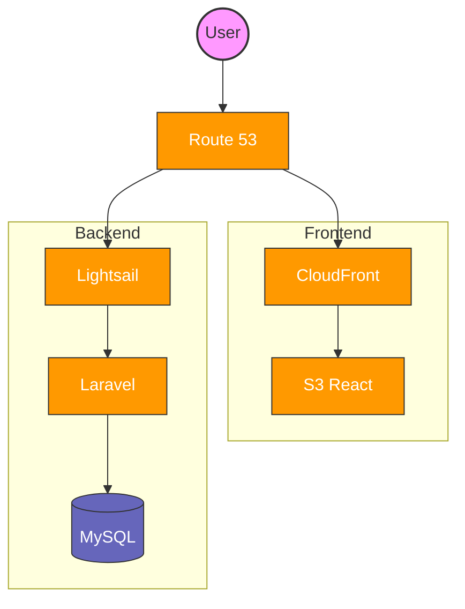

# CT4A 卒業制作 4 班 AWS  使用料金試算書

本資料は CT4A 卒業制作 4 班の AWS 使用料金試算書です。  
Lightsail ＋ S3 をベースとした最小コスト構成の月額目安をまとめたものです。

## 1. 対象アーキテクチャ

| レイヤ           | サービス                           | 用途                                 | 備考                                                                                                             |
| ---------------- | ---------------------------------- | ------------------------------------ | ---------------------------------------------------------------------------------------------------------------- |
| **アプリ／DB**   | Lightsail (Linux/Unix 1 GB プラン) | Laravel + MySQL (同一インスタンス)   | 月額 **\$5** [Amazon Web Services, Inc.](https://aws.amazon.com/lightsail/pricing/?utm_source=chatgpt.com)       |
| **静的フロント** | S3 Standard                        | React ビルドファイル保管 (5 GB 想定) | 単価 0.026 USD/GB [Amazon Web Services, Inc.](https://aws.amazon.com/jp/s3/pricing/)                             |
| **CDN**          | CloudFront                         | 低レイテンシ配信 (50 GB/月想定)      | 単価 0.085 USD/GB [Amazon Web Services, Inc.](https://aws.amazon.com/cloudfront/pricing/?utm_source=chatgpt.com) |
| **DNS**          | Route 53                           | ドメイン管理                         | \$0.50/zone [Amazon Web Services, Inc.](https://aws.amazon.com/route53/pricing/?utm_source=chatgpt.com)          |

### 2.1 設計についての備考

-   Laravel+React の基本的な構成
-   バックエンドについては最小構成とするため、ECS などを用いず、Lightsail のみで構成

## 2. 最小構成の月額見積り

| サービス               | 想定量   | 単価             | 月額               |
| ---------------------- | -------- | ---------------- | ------------------ |
| Lightsail インスタンス | 常時稼働 | \$5.00 (東京)    | **\$5.00**         |
| S3 ストレージ          | 5 GB     | \$0.026/GB       | **\$0.13**         |
| S3 転送                | 50 GB    | \$0.09/GB (東京) | **\$4.50**         |
| CloudFront データ転送  | 50 GB    | \$0.085/GB       | **\$4.25**         |
| Route 53 Hosted Zone   | 1 zone   | \$0.50           | **\$0.50**         |
| **合計**               |          |                  | **≈ \$14.38 / 月** |

### 2.1 見積についての備考

-   リージョン想定: 東京リージョン
-   ユーザ数の増加によるスケールは行わない

## 3. トータルコスト

運用期間を 12 ヶ月とした場合、以下のコストがかかる

14.38$ \* 12 = 172.56$

## 4. アーキテクチャ図

